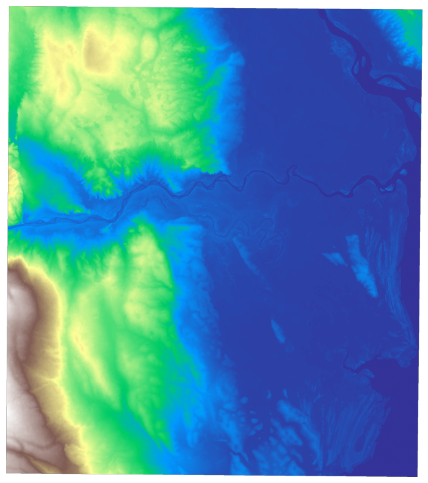

# Mozambique 2019 Flood
- DEM: 
  - Shape: (2624, 2321)
  - Resolution: 480 m
- Rainfall: 
  - Duration: 2019-03-14 3am to 2019-03-20 3am
  - Frequency: 30 minutes
  - Name Convention: f"{YYYYMMDD}-S{hhmmss}.tif"
- Flood:
  - Duration: 2019-03-14 3am to 2019-03-20 3am
  - Frequency: 5 minutes
  - Name Convention: f"{idx}.tif" where idx is seconds and takes values from 0 to 518400 (that is 6 days)

